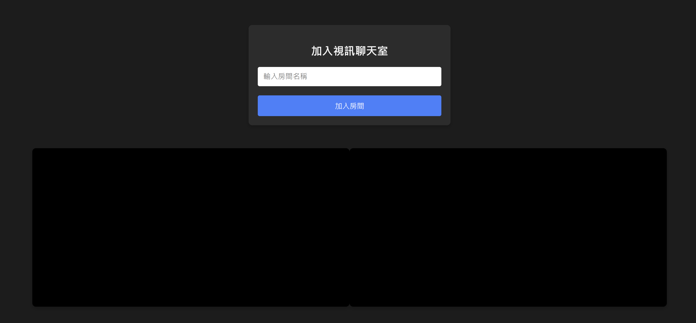

# Web-RTC
This demo presents a real-time communication system that effectively separates the front-end and back-end components. By leveraging Nginx as a reverse proxy, developers can efficiently test and iterate on the application without the need for repeated image builds. This setup allows for a streamlined development workflow where changes can be quickly validated.

## 💡 Feature
- 使用 Docker compose 部署至正式環境
- 使用 Nginx來達到前後端分離
- 使用 Node Js 建立網頁後端
- 使用 WebRTC 建立視訊聊天室與文字聊天室

## Start
```bash
    $ cd $PROJECT_ROOT
    $ docker compose up -d
```
## Demo
 1. Go to http://127.0.0.1:8080
 2. Enter your room name (if it doesn't exist, it will create new room)

## ✨ Demonstrate
### Front-End
 


